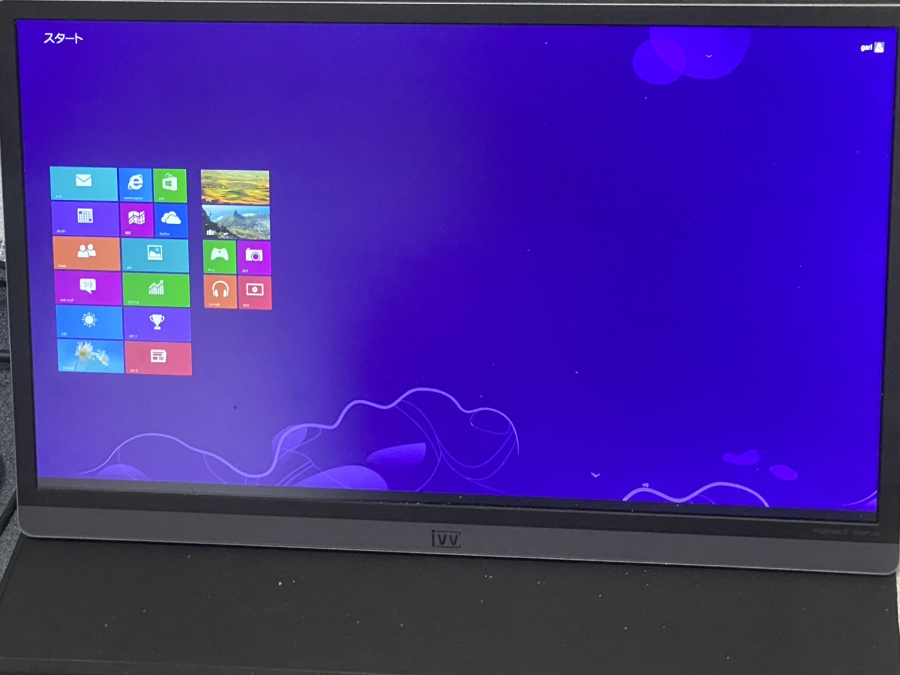
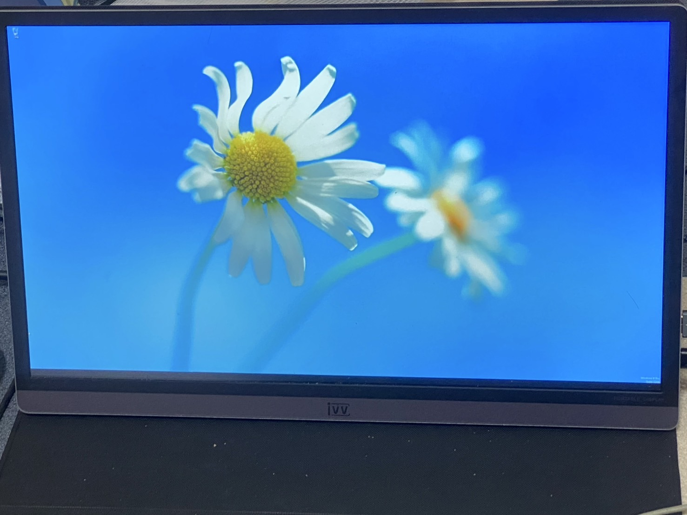
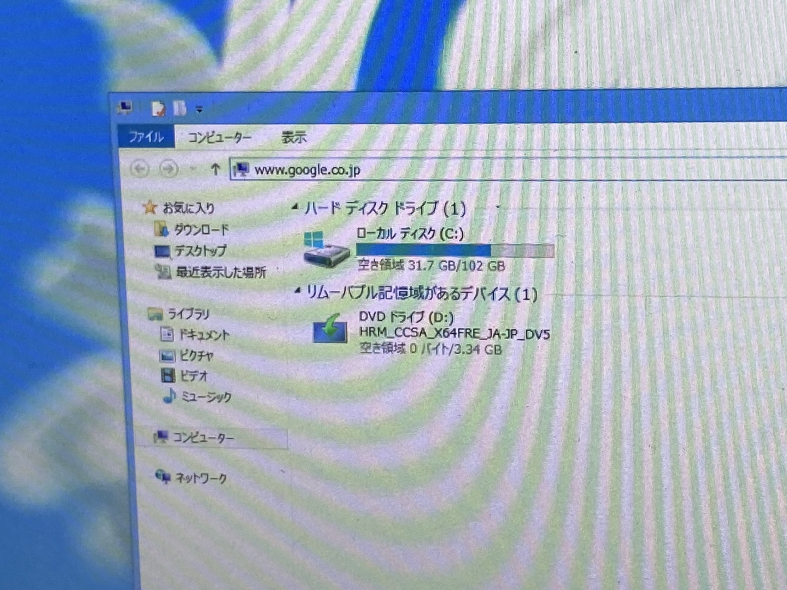
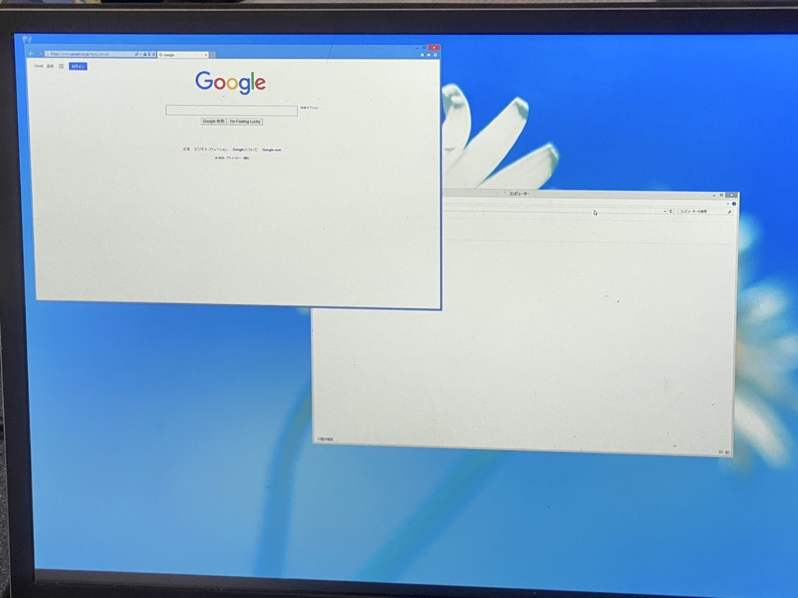
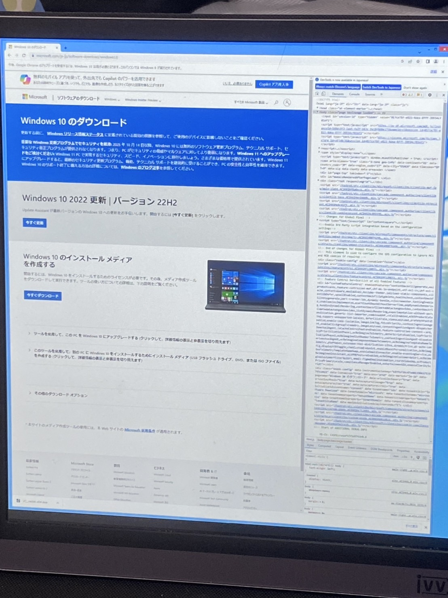
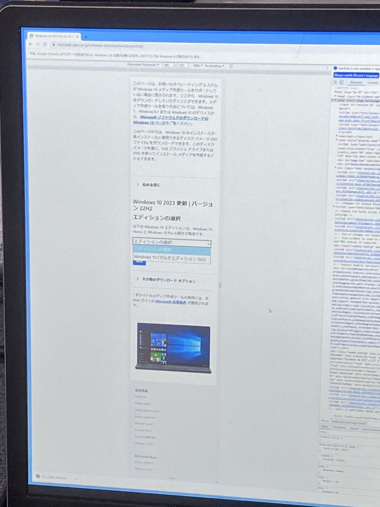
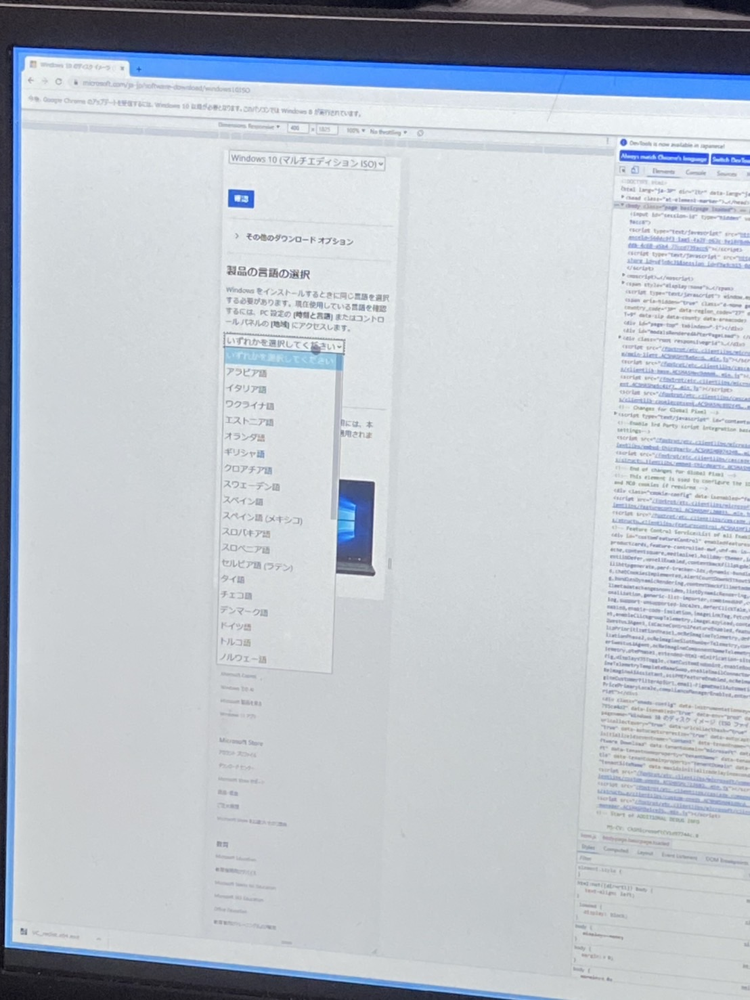
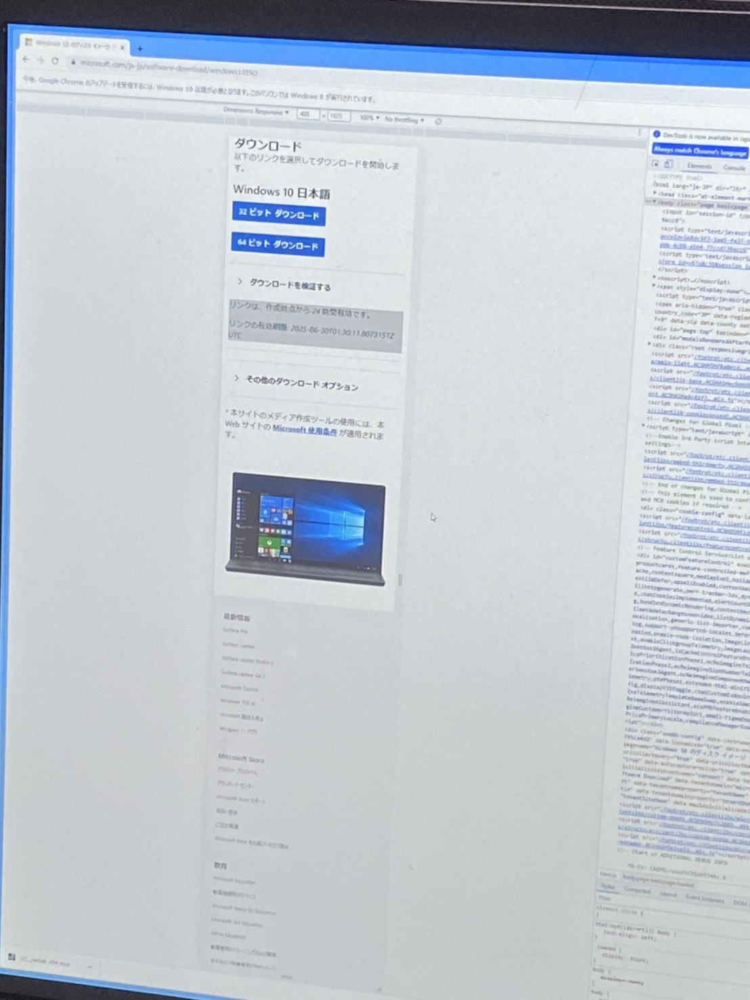

# 要件非対応マシンにWindows 11を入れようとしてイキかけた話

## はじめに

FUJITSU PRIMERGY TX1310 M3(2年前の合宿に持ってきたアイツ)はWin11非対応構成のマシンだが、インストールしてみたくなってしまった  
対応してるモデルのマシン買えよって声が聞こえそうですが、敢えてこう言いたい

そんなできるの分かってることやって、何が楽しいんですか!?w(勘違い甚だしいヤツ)  
結果がどうなるか分からないからこそ楽しいんでしょうががががが!!(完全にイカれてる)

## 対象マシンと周辺機器

- **機種名**: FUJITSU PRIMERGY TX1310 M3  
  [公式のシステム構成図](https://jp.fujitsu.com/platform/server/primergy/pdf/20210202/tx1310_m3.pdf)
- **CPU**: Intel Xeon E3-1225v6（第7世代、公式にはWin11非対応）  
- **ネットワークアダプター**: TP-Link TG-3468 (PCI-E ギガビットLANアダプタ)  
  [Amazonリンク](https://www.amazon.co.jp/dp/B003CFATNI?ref=ppx_yo2ov_dt_b_fed_asin_title&th=1)  
- **モニタ**: IVV モバイルモニター 12.5インチ 4K対応  
  [Amazonリンク](https://www.amazon.co.jp/dp/B09JW5874X?ref=ppx_yo2ov_dt_b_fed_asin_title)

## Windows 8 インストール開始

- Windows 8 Proのライセンスキーは所持
- オンボードにLANポートは存在するが、インストール直後はTP-Linkの方しか通信が行えなかった…
- モバイルモニタの高解像度のため、Windows8起動時に画面が小さく中央にしか表示されず、作業時はiPhoneのカメラの広角で覗き込みながら作業 ("虫眼鏡作戦")

- インストール後、Windows 8 ライセンス認証をオンラインで完了
-  既にサポート終了しているためWindows Update不可
- Intel公式から「Ethernet Connection I219-LM」ドライバが入手可能とのことで、先にこれをやっておけばよかったかもしれない…
  - Ethernet Connection I219-LMのドライバページからWin8.1用のドライバを入れるも、そんなものないとエラーメッセージを吐く
  - デバイスマネージャではドライバはあたっているが、ドライバの更新を行うも既にあたっているとの表示…
- Internet Explorerは解像度の問題でタスクバーから選択不可、  
  `Windowsキー + E` でエクスプローラを起動し、アドレスバーにURL入力してWebアクセス

- IE(Win8のデフォルトブラウザはIE)だが、まともに表示できるサイトは限られるため、Chromeをダウンロード・インストール

## Windows 10へアップグレード

- Microsoft公式サイトからWindows 10 ISOを入手
  - PCで直接アクセスするとメディア作成ツールのリンクしかないため、
  - DevToolsでUser-Agentをスマホに偽装しISOダウンロード可能に

- 7-ZipでISO展開し(右クリックでマウントを選択することでも可能)、`setup.exe`を実行
- Visual C++ 再頒布可能パッケージ (x64)[公式ページ](https://learn.microsoft.com/ja-jp/cpp/windows/latest-supported-vc-redist?view=msvc-170)をインストールしていなかったため、インストールできず…(これに行きつくのに4時間程度消費…w)
- 再頒布可能パッケージインストール後、再度`setup.exe`実行しWindows 10にアップグレード

## Windows Update

- Windows Updateでドライバなど最新状態に  
- この時点でオンボードLANが動作可能になっていることに気づかず、TP-Link LANアダプタを引き続き使用(ケーブル挿してるのこっちだもん)  
  → これが悲劇を生むことになる…

## Windows 11 アップグレード試行

- Windows 11 ISOをダウンロード、7-Zipで展開  
- コマンドプロンプトで`setup /product server`を実行するもアップグレードできず…(30%くらいに到達後エラー)  
- DISMやSFCコマンド([参考](https://onoredekaiketsu.com/repair-windows-with-dism-and-sfc-scannow/?fbclid=IwY2xjawLMdN1leHRuA2FlbQIxMABicmlkETFHbmIxcWJoU3NGRnJiM242AR5hd4CTSlECaN2ZkFNqAo9iv6AX_24rQzQ3OlIldiHZnJTzinpLEQyljLfq-A_aem_0kBt_OpDnkA8yhoh_AIsbA))でシステム修復後に行うも改善せず(66%くらいに到達後エラー)
- ChatGPT先生に相談し、色々と試すも状況は改善せず…
- 何度もChatGPT先生に相談し、セーフモードで不要サービス停止後、セーフモードを解除して再実行しろとのことで試すも改善せず
- 再度ChatGPT先生に相談するとLANケーブルやPCIカードなど不要な機器を外した最小構成で実行しろと言われ、試したところアップグレードできた(歓喜の瞬間)

## 悲劇再来

- 再起動時にTP-LinkのLANアダブタにケーブルを差し込んで起動するとブルースクリーンが発生し、何度再起動しても症状改善せず…  
- LANケーブルを抜いて起動すると問題なく起動。しかし、ログイン後にLANケーブル差すと即ブルースクリーン  
- TP-Linkアダプタ＋LANケーブルが原因であることを確定  
  → ようやくTP-Linkアダプタが原因であることを特定できた(長かった…)
- ダメ元でオンボードLANの方に繋ぐが、問題なく通信できていることが発覚!!

## リベンジ成功の流れ

1. Win8をインストール (モバイルモニタ＋虫眼鏡作戦)
2. Visual C++ 再頒布可能パッケージを導入
3. Chromeダウンロード後、Win10のISOをダウンロード
4. Windows10のISOをマウント、`setup.exe` 実行でアップグレード
5. Windows Updateを完了後再起動し、オンボードLANにケーブルを接続したところ、この時点で問題なく通信できていることを確認
6. Win11のISOをダウンロードしてマウント
7. `setup /product server` コマンドを実行し正常にWindows 11にアップグレード
8. 問題なくログインも完了

## 総評と教訓

- 旧OSからのアップグレードは手間とトラブルの連続  
- ハードウェア構成、特にネットワークアダプタの互換性が大きなポイント  
- 最小構成でのアップグレード試行がトラブル回避に有効  
- User-Agent偽装などのテクニックがダウンロード時に役立つ  
- Visual C++再頒布パッケージ等、基盤的なランタイムは必ず整備すべし  
- ChatGPTなどAIツールもトラブルシューティングに活用可能  
- モバイルモニタ＋虫眼鏡作戦は特殊な状況下での必殺技
